# FindYourClub

FindYourClub helps high school students discover the right clubs based on their interests and career goals.

🌐 Live at: https://find-your-club-seven.vercel.app

---

## How It's Built

```mermaid
flowchart LR
    classDef student fill:#fef3c7,stroke:#f59e0b,color:#92400e,font-weight:bold
    classDef frontend fill:#e0e7ff,stroke:#6366f1,color:#3730a3,font-weight:bold
    classDef backend fill:#6366f1,stroke:#4f46e5,color:#ffffff,font-weight:bold
    classDef search fill:#fef9c3,stroke:#eab308,color:#713f12,font-weight:bold
    classDef llm fill:#f3e8ff,stroke:#8b5cf6,color:#5b21b6,font-weight:bold
    classDef data fill:#d1fae5,stroke:#10b981,color:#065f46,font-weight:bold

    S(["👤 Student\nopens the site"]):::student

    subgraph FE ["🖥️  Frontend  —  runs in the browser"]
        Q["❓ Quiz\n5 interest questions"]:::frontend
        C["💼 Career Match\npick up to 2 careers"]:::frontend
        SC["🏫 School Search\ntype your school name"]:::frontend
        R["🎯 Results\nclub cards + links"]:::frontend
    end

    subgraph BE ["⚡ Backend  —  Vercel Serverless Function"]
        API["/api/clubs\n orchestrates everything"]:::backend
    end

    subgraph AI ["🤖 AI Layer  —  Agentic LLM Pattern"]
        BRAVE["🔍 Step 1 — Brave Search\nfinds real club pages\nfor the school"]:::search
        INJECT["💉 Step 2 — Context Injection\nURL results added\nto Claude's prompt"]:::backend
        LLM["✨ Step 3 — Claude Haiku\ngenerates ranked clubs\nas structured JSON"]:::llm
    end

    ODS[("🗄️ OpenDataSoft\n102K US Schools\ndatabase")]:::data

    S --> Q --> C --> SC
    SC -- "search school name" --> ODS
    ODS -- "returns matching schools" --> SC
    SC --> R

    R -- "POST: school + careers" --> API
    API --> BRAVE
    BRAVE -- "top 5 URLs + titles" --> INJECT
    INJECT --> LLM
    LLM -- "JSON: clubs + reasons" --> API
    API -- "clubs + research links" --> R
```

### 🧠 The Agentic LLM Pattern — Search → Inject → Generate

| Step | What happens | Why it matters |
|------|-------------|----------------|
| 🔍 **Search** | Brave Search finds real web pages for the school's clubs | Grounds the AI in real data, not just training memory |
| 💉 **Inject** | Search results are added to Claude's prompt as context | The LLM sees actual URLs and page titles before answering |
| ✨ **Generate** | Claude returns ranked clubs + reasons as structured JSON | Output is reliable, parseable, and personalized |

> This is the foundation of modern AI agents — giving an LLM **tools** (like web search) so it can gather fresh context before reasoning.
