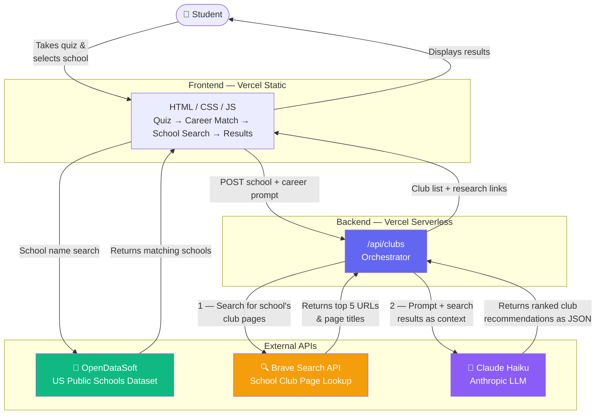

# FindYourClub

FindYourClub helps high school students discover the right clubs based on their interests and career goals.

Live at: https://find-your-club-seven.vercel.app

---

## Architecture

### How the Agentic LLM Pattern Works

1. **Tool Call** — Before asking Claude anything, the Vercel function calls Brave Search as a tool to find real web pages for the selected school's clubs and activities.
2. **Context Injection** — The search results (URLs + titles) are injected into the Claude prompt as grounding context.
3. **Grounded Generation** — Claude generates club recommendations informed by real, up-to-date web sources rather than relying solely on training data.
4. **Structured Output** — Claude returns JSON, which the frontend parses to render ranked club cards and a Recommended Links section.

This pattern — **search → inject → generate** — is the core of agentic LLM design: the model is given tools to gather context before it reasons.
